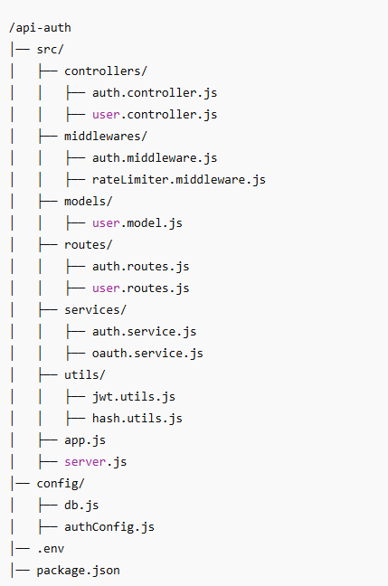

# SecureAuthAPI 
É uma API de Autenticação e Autorização Completa.

# Tecnologias utilizadas
- Node.js(Express/Nest.js)
- JWT
- OAuth
- Redis
- PostgreSQL/MySQL

# Funcionalidade da API
- Registro/Login via e-mail e senha(JWT)
- Login via AOuth(Google, GitHub, Facebook)
- Reifresh Token para manter a sessão
- Esquema de permissões(admin, usuário, convidado)
- 2FA (Google Authenticator, OTP vai e-mail)

# Segurança Avançada
- Rate Limiting para evitar brute-force
- Proteção contra XSS, CSRF, SQL Injection
- Criptografia de senhas (bcrypt)

# Estrutura do Projeto

# Requisitos do Sistema

## Requisitos Funcionais(RF)
- ✅ RF01 - O sistema deve permitir o registro de usuários via e-mail e senha.
- ✅ RF02 - O sistema deve permitir autenticação via JWT.
- ✅ RF03 - O sistema deve permitir login via OAuth (Google, GitHub, Facebook).
- ✅ RF04 - O sistema deve permitir refresh token para manter a sessão.
- ✅ RF05 - O sistema deve implementar níveis de permissão (admin, usuário, convidado).
- ✅ RF06 - O sistema deve permitir redefinição de senha via e-mail.
- ✅ RF07 - O sistema deve permitir ativar/desativar autenticação de dois fatores (2FA).
- ✅ RF08 - O sistema deve permitir logout e revogação de tokens ativos.

## Requisitos Não Funcionais(RNF)
- 🔹 RNF01 - O sistema deve ser desenvolvido em Node.js usando Express ou Nest.js.
- 🔹 RNF02 - O banco de dados deve ser PostgreSQL/MySQL com ORM Prisma/Sequelize.
- 🔹 RNF03 - O sistema deve usar Redis para cache de sessões e rate limiting.
- 🔹 RNF04 - O sistema deve seguir boas práticas de segurança (XSS, CSRF, SQL Injection).
- 🔹 RNF05 - O sistema deve ter documentação via Swagger ou Redoc.

## Requisitos de Segurança(RS)
- 🔐 RS01 - O sistema deve usar bcrypt para hash de senhas.
- 🔐 RS02 - O sistema deve ter rate limiting para evitar ataques de força bruta.
- 🔐 RS03 - O sistema deve usar Helmet para proteger contra vulnerabilidades web.
- 🔐 RS04 - O sistema deve registrar logs de login/logout para auditoria.
- 🔐 RS05 - O sistema deve utilizar JWT assinado com chave secreta.

# Endpoints Principais

# Como Instalar e Rodar o Projeto

# Contribuições e Contato